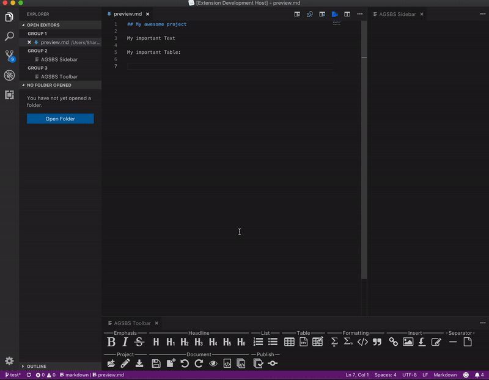

AGSBS Visual Studio Code Extension
----

## About this extension

This package is developed to make the transcription process more effective.
It is a GUI toolkit which helps to transcribe study material to markdown which fulfill the AGSBS guidelines. A lot of its functions are executed and processed by MAGSBS. Our extension parses the returns strings and writes them into files, shows notifications, warnings and much more. It simply helps you to write and edit markdown faster and more easily.

## What is AGSBS?

AGSBS (Arbeitsgruppe Studium für Blinde und Sehbehinderte eng. working group for blind and visually impaired Students) is a working group of TU Dresden (germany). AGSBS works on (automatically) transcribing study material to offer it to the blind an visually impaired students.

## Issues and new features

There are a few open issues, please check [Open Issues](https://github.com/TUD-INF-IAI-MCI/agsbs_matuc_extension/issues).

If you found a new issue. Describe how it occurs:

- Which view was opened?
- Did you use a shortcut or a icon?
- Was a error message shown?
- What files was open?

Also an screenshot is very helpful

## Functions

- GUI for the creation of different markdown table
  - grid table
  - pipe table
  - simple table
- import data from a csv file and editing markdown tables:

- GUI for adding a image and add alternative text
- Formatting the markdown by various icons
- generation of HTML by using [Matuc](https://github.com/TUD-INF-IAI-MCI/AGSBS-infrastructure/tree/master/MAGSBS) (Markdown TU Dresden Converter)
- GUI for adding Links
- preview for Markdown
- insertation of textboxes or annotations
- insertation of text frames (decoration)
- annotation of the creator

Please note that you have to install Matuc to use all features.

## Multilanguage

Supported languages of GUI are German and English. Shown warnings and notifications are created by MAGSBS. Other languages can be used in MAGSBS. For more information read [MAGSBS Localization](https://github.com/TUD-INF-IAI-MCI/AGSBS-infrastructure#localization)

## Creation of this Project
This Extension for Visual Studio Code was created by Lucas Vogel (lucas.vogel2 &#91;at&#93; tu-dresden.de) and is a recreation of the already existing [AGSBS Atom Plugin](https://github.com/TUD-INF-IAI-MCI/agsbs_atom_package). 
